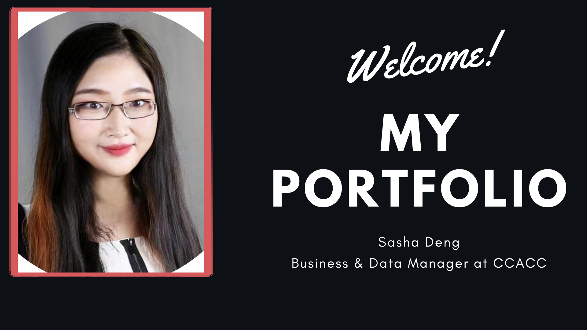

# Sasha Deng
<!-- (degree or title) -->
## Professional Portfolio
---
<!-- include profile photo -->

---
### About Me
This is [my site](sheysia.github.io). Thank you for checking out my portfolio! It's nice to meet you!

You can also find me on [LinkedIn](https://www.linkedin.com/in/sasha-deng-1a5326100/)

# Areas of Interest
## Data Analytics
- Tableau
- SQL
- EFL
- Data pipelines
- Google Analytics
## Python
- Pandas
- Numpy
- Matplotlib

---

## I have worked on projects that Include:
- Marketing Segmentation
- Customer Profiling
- Positioning Analysis
- Predictive Modeling
- Time series Analysis
- A/B testing
- Sensitivity Analysis

---
## Web & App Development
- AWS
- .Net
- Unity
- WordPress
- Construct 3
- Python
- Javascript
- Testing & Debugging
- Jupyter (Jupyter Notebooks)
- VSCode (Visual Studio Code)

### Projects I contribute to:
- [Ecopod](https://casls.uoregon.edu/legacy-projects/student-programs/ecopod-place-based-language-learning/)
- [Games2Teach](https://games2teach.uoregon.edu/)
- [Linguafolio](https://linguafolio.uoregon.edu/)
- [CALLM](https://casls.uoregon.edu/legacy-projects/student-programs/chinese-online-modules/)
- [Bridging Project](https://casls.uoregon.edu/legacy-projects/student-programs/bridging-project/)
### Personal Sites Created
- [Glitch](https://sasha-portfolio.glitch.me/)
- [Funcat](https://sashafinal-kishatty.glitch.me/)

## Media I have Produced:
I have experience in Adobe Premier & After Effects and have demonstrated this on my YouTube Channel which you can find below.

- [Youtube Channel](https://www.youtube.com/channel/UCQha3lxuPVoDOJtA_k2nLBw)

## Finance and Business Management:

- FP&A
- Budgeting
- CRM
- Salesforce
- Streak
- Clover
- Quickbooks
## Project Management:
- Agile
- Jira

## Other Sample works:

Examples here

## Contact Me
- [Email](mailto:)
- [LinkedIn](https://www.linkedin.com/in/sasha-deng-1a5326100/)
- [Github](your github)
